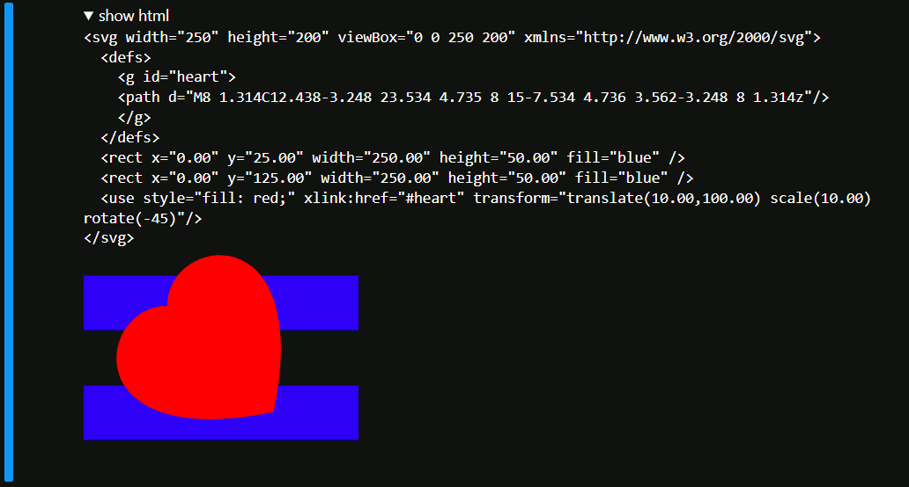
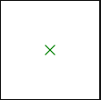

# svg_snip

`svg_snip` is a Python package that provides a collection of functions for generating SVG snippets. These functions are designed to simplify the creation of SVG elements, such as rectangles, circles, lines, text and more. You can use this to display procedurally generated SVG graphics in your Jupyter notebook.

With an optional install of ipywidgets and ipycanvas, also as an interactive visualization tool, which generates SVG snippets in the backend and performs the rendering in the frontend.

## Installation

### Using pip
You can install `svg_snip` using pip:

```bash
pip install svg_snip
```


### Using `setup.py`

```sh
git clone https://github.com/aaichert/svg_snip
cd svg_snip
python setup.py install
```

## Basic Usage

```py
from svg_snip.Composer import Composer
from svg_snip.Elements import circle
svg = Composer([200,200])
svg.add(circle, cx=100, cy=100, r=10, stroke='blue')
print(svg.render())
```

produces:

```html
<svg width="200" height="200" viewBox="0 0 200 200" xmlns="http://www.w3.org/2000/svg">
  <circle cx="100.00" cy="100.00" r="10.00" stroke="blue" />
</svg>
```


## Displaying SVG in Jupyter

```py
from svg_snip.Composer import Composer
from svg_snip.Elements import heart, rect
svg = Composer([250,200])
svg.add(rect, x=0, y=25, width=250, height= 50, fill='blue')
svg.add(rect, x=0, y=125, width=250, height= 50, fill='blue')
svg.add(heart, x=10, y=100, size=100, angle=-45, fill='red')

svg.display(debug=True)
```

produces:



## Extending the functionality

All you need to call `Composer.add` is a function that returns a string. Of course the string should be valid `<svg>`. 

Here is a simple example which adds two lines that form an X to an SVG:

```py
def x(x=0, y=0):
    return f""" \
<line x1="{x-5}" y1="{y-5}" x2="{x+5}" y2="{y+5}" stroke-width="2"/>
<line x1="{x-5}" y1="{y+5}" x2="{x+5}" y2="{y-5}" stroke-width="2"/>
"""
```

You can then use the `x` function along any other element from svg_snip.Elements, e.g. draw the green `x` on a white `rect`

```py
from svg_snip.Composer import Composer
from svg_snip.Elements import rect

svg = Composer((100,100))
svg.add(rect, x=0, y=0, width=100, height=100, fill='white')
svg.add(x, x=50, y=50)
svg.display()
```



### Advanced examples

Please see [example.ipynb](example.ipynb) for more information on how to make advanced use of this library.

## License

This project is licensed under the Apache 2.0 license.