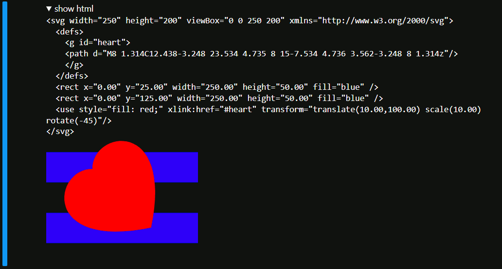
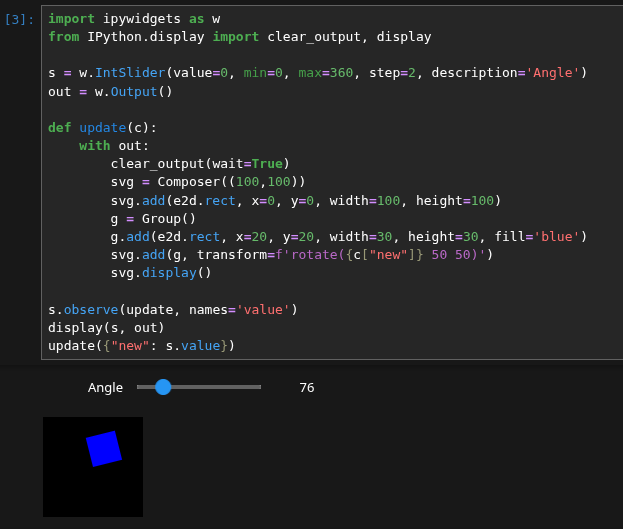
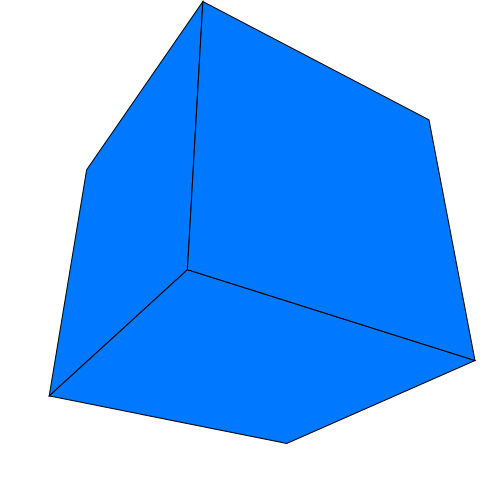

# svg_snip

`svg_snip` is a Python package that provides a collection of functions for generating SVG snippets. These functions are designed to simplify the creation of SVG elements, such as rectangles, circles, lines, text and more. You can use this to display procedurally generated SVG graphics in your Jupyter notebook.

With an optional install of ipywidgets and ipycanvas, also as an interactive visualization tool, which generates SVG snippets in the backend and performs the rendering in the frontend.

## Installation

### Using pip (recommended)
You can install `svg_snip` from PyPI using pip:

```bash
pip install svg_snip
```

### From source
You can also install directly from the GitHub repository:

```bash
pip install git+https://github.com/aaichert/svg_snip.git
```

### Optional extras
The core package only requires `numpy` and supports SVG generation without Jupyter or Pillow.

- `Pillow` is optional and enables embedding PIL images into SVG with `svg_snip.Composer.image()`.
- `IPython`, `ipywidgets`, and `ipycanvas` are optional and enable Jupyter display helpers.

Install optional extras as needed:

```bash
pip install svg_snip[pillow]
pip install svg_snip[jupyter]
pip install svg_snip[full]
```

Or clone and install locally:

```bash
git clone https://github.com/aaichert/svg_snip
cd svg_snip
pip install -e .
```

## Basic Usage

```py
from svg_snip.Composer import Composer
from svg_snip.Elements import circle
svg = Composer([200,200])
svg.add(circle, cx=100, cy=100, r=10, stroke='blue')
print(svg.render())
```

produces:

```html
<svg width="200" height="200" viewBox="0 0 200 200" xmlns="http://www.w3.org/2000/svg">
  <circle cx="100.00" cy="100.00" r="10.00" stroke="blue" />
</svg>
```


## Displaying SVG in Jupyter

```py
from svg_snip.Composer import Composer
from svg_snip.Elements as e2d
svg = Composer([250,200])
svg.add(e2d.rect, x=0, y=25, width=250, height= 50, fill='blue')
svg.add(e2d.rect, x=0, y=125, width=250, height= 50, fill='blue')
svg.add(e2d.heart, x=10, y=100, size=100, angle=-45, fill='red')

svg.display(debug=True)
```

produces:



This example also demonstrates, that the library is able to correctly collect `<defs>` for later reference.


## Groups

Here is an example that defins a `Group`. You can add SVG elements to the `Group` just like you would to a `Composer`.

This allows you to define complex objects once and re-use them as needed.

You can pass additional attributes, such as a `transform` to the group

```py
g = Group()
g.add(e2d.rect, x=20, y=20, width=30, height=30, fill='blue')
svg.add(g, transform=f'rotate({10} 50 50)')
```

## Extending the functionality

All you need to call `Composer.add` is a function that returns a string. Of course the string should be valid `<svg>`. 

Here is a simple example which adds two lines that form an X to an SVG:

```py
def x(x=0, y=0):
    return f""" \
<line x1="{x-5}" y1="{y-5}" x2="{x+5}" y2="{y+5}" stroke-width="2"/>
<line x1="{x-5}" y1="{y+5}" x2="{x+5}" y2="{y-5}" stroke-width="2"/>
"""
```

You can then use the `x` function along any other element from svg_snip.Elements, e.g. draw the green `x` on a white `rect`

```py
from svg_snip.Composer import Composer
from svg_snip.Elements import rect

svg = Composer((100,100))
svg.add(rect, x=0, y=0, width=100, height=100, fill='white')
svg.add(x, x=50, y=50)
svg.display()
```


### Interactive Visualization in Jupyter

Here is an example using `ipywidgets` to create a slider that can affect the visualization interactively. Jupyter is decently fast with updating short HTML fragments. You loose most time running the python kernel in the backend and sending resulting text to the frontend.

For debugging and scientific visualizations, this is easily fast enough.

```py
import ipywidgets as w
from IPython.display import clear_output, display

s = w.IntSlider(value=0, min=0, max=360, step=2, description='Angle')
out = w.Output()

def update(c):
    with out:
        clear_output(wait=True)
        svg = Composer((100,100))
        svg.add(e2d.rect, x=0, y=0, width=100, height=100)
        g = Group()
        g.add(e2d.rect, x=20, y=20, width=30, height=30, fill='blue')
        svg.add(g, transform=f'rotate({c["new"]} 50 50)')
        svg.display()

s.observe(update, names='value')
display(s, out)
update({"new": s.value})
```




## Recommended Additional Packages

The package [ProjectiveGeometry23](https://pypi.org/project/ProjectiveGeometry23/) can be used for simple 3D graphics.


Please see [example_3D_cube.ipynb](example_3D_cube.ipynb) for more information on how to make advanced use of this library. You can rotate this cube interactively when you run the Jupyter notebook.




Here is an example on how to use the library for vector-overlays on existing raster images, e.g. for scientific publication.


The package [html_snippets](https://github.com/aaichert/html_snippets) is in an earlier development stage. However, it supports generating animations based on SVG frames for use in HTML documents.


```py
from html_snippets import html_animation_css
import numpy as np

from svg_snip.Composer import Composer
import svg_snip.Elements as e2d
import svg_snip.Elements3D as e3d

from ProjectiveGeometry23.central_projection import ProjectionMatrix
from ProjectiveGeometry23.homography import rotation_x, rotation_z

P_lookat = ProjectionMatrix.perspective_look_at(
    eye=np.array([0, 0, 250]),
    center=np.array([0, 0, 0]),
    image_size=(300, 300),
    fovy_rad=0.7
)

def generate_svg_cube(angle_x, angle_z):
    svg = Composer((300,300))
    svg.add(e2d.rect, fill='white', width=300, height=300)
    svg.add(e3d.wire_cube, min=[-50,-50,-50], max=[50,50,50], stroke='black')
    T = rotation_x(angle_x) @ rotation_z(angle_z)
    return svg.render(P=P_lookat.P @ T)

# Generate an animation
frames = [generate_svg_cube(1,angle) for angle in np.linspace(0, np.pi / 2, 50)]
html_header, html_body = html_animation_css(frames, frame_duration_sec=0.05)
# Store as HTML file
with open('example_animation.html', 'w') as file:
    file.write(html_header+html_body)
    
```

[example_animation.html](example_animation.html)


## License

This project is licensed under the Apache 2.0 license.